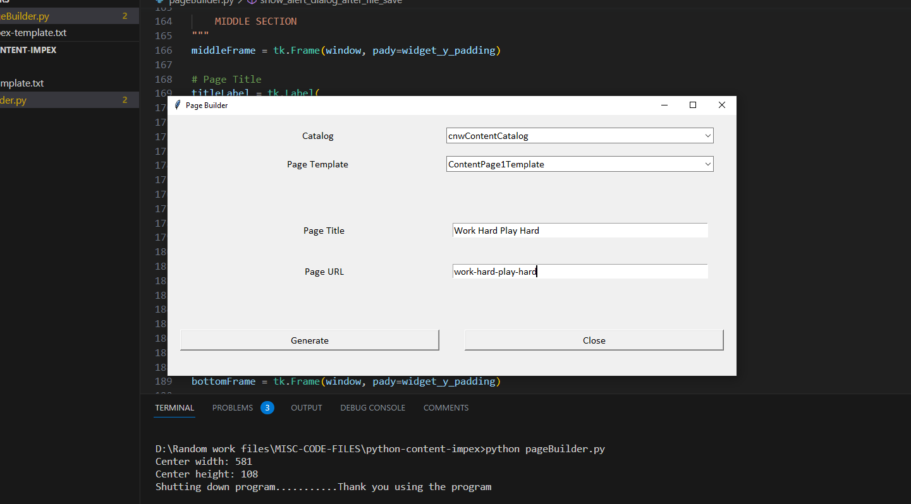
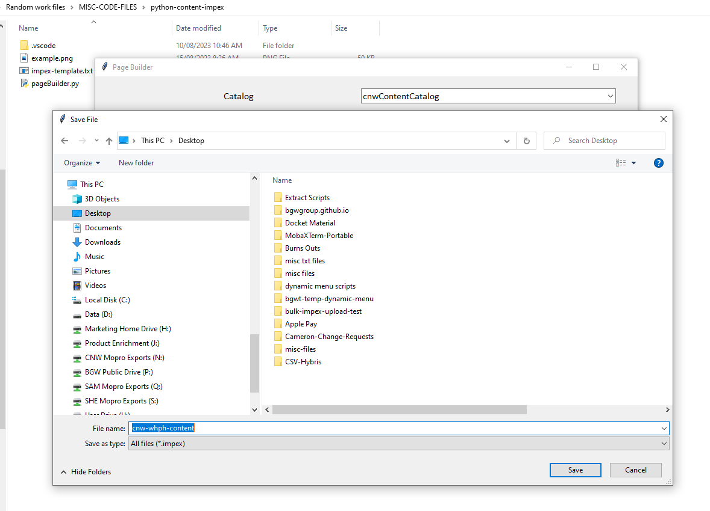
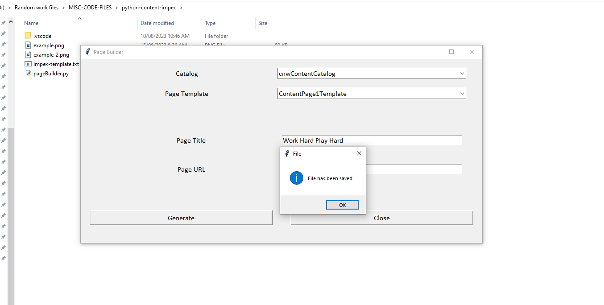

# python-pagebuilder
A Python Script To Build An Impex for WCMS Page, Component and Content Slots

- The pageBuiler application was designed using Python's Tkinter toolkit for the GUI
- The objective is to create, build and write to an Impex file

## Display





## Example of output file
```Impex
#=================================================================================================================================
#================================================ STAGED ==================================================
#=================================================================================================================================

# Macros / Replacement Parameter definitions
$contentCatalog=bgwtechContentCatalog
$version=Staged

$contentCV=catalogVersion(CatalogVersion.catalog(Catalog.id[default=$contentCatalog]),CatalogVersion.version[default=$version])[default=$contentCatalog:$version]
$picture=media(code, $contentCV);
$image=image(code, $contentCV);
$media=media(code, $contentCV);
$page=page(uid, $contentCV);
$contentPage=contentPage(uid, $contentCV);
$siteResource=jar:au.com.cnw.initialdata.setup.InitialDataSystemSetup&/cnwinitialdata/import/sampledata/contentCatalogs/$contentCatalog
$jarResourceCms=jar:au.com.cnw.initialdata.setup.InitialDataSystemSetup&/cnwinitialdata/import/cockpits/cmscockpit

# Language
$lang=en

INSERT_UPDATE ContentPage;$contentCV[unique=true];uid[unique=true];name;title;masterTemplate(uid,$contentCV);label;defaultPage[default='true']; approvalStatus(code)[default='approved'];homepage[default='false'];previewImage(code, $contentCV)
;;panasoniccameraspage;Panasonic Cameras;Panasonic Cameras;SingleColumnTemplate;panasonic-cameras;;;;

INSERT_UPDATE CMSParagraphComponent;$contentCV[unique=true];uid[unique=true];name;&componentRef;visible[default='true'];content[lang=en]
;;panasoniccamerasparagraph;Panasonic Cameras;panasoniccamerasparagraph;true;"Content"

INSERT_UPDATE ContentSlot;$contentCV[unique=true];uid[unique=true];name;active;cmsComponents(&componentRef)
;;CenterContentSlot-PanasonicCameras;Center Content Slot for PanasonicCameras;true;panasoniccamerasparagraph
;;RightContentSlot-PanasonicCameras;Right Content Slot for PanasonicCameras;true;
;;LeftContentSlot-PanasonicCameras;Left Content Slot for PanasonicCameras;true;

INSERT_UPDATE ContentSlotForPage;$contentCV[unique=true];uid[unique=true];position[unique=true];page(uid,$contentCV)[unique=true];contentSlot(uid,$contentCV)[unique=true]
;;CenterContent-PanasonicCameras;CenterContent;panasoniccameraspage;CenterContentSlot-PanasonicCameras
;;RightContent-PanasonicCameras;RightContent;panasoniccameraspage;RightContentSlot-PanasonicCameras
;;LeftContent-PanasonicCameras;LeftContent;panasoniccameraspage;LeftContentSlot-PanasonicCameras      


#=================================================================================================================================
#================================================ ONLINE ==================================================
#=================================================================================================================================

# Macros / Replacement Parameter definitions
$contentCatalog=bgwtechContentCatalog
$version=Online

$contentCV=catalogVersion(CatalogVersion.catalog(Catalog.id[default=$contentCatalog]),CatalogVersion.version[default=$version])[default=$contentCatalog:$version]
$picture=media(code, $contentCV);
$image=image(code, $contentCV);
$media=media(code, $contentCV);
$page=page(uid, $contentCV);
$contentPage=contentPage(uid, $contentCV);
$siteResource=jar:au.com.cnw.initialdata.setup.InitialDataSystemSetup&/cnwinitialdata/import/sampledata/contentCatalogs/$contentCatalog
$jarResourceCms=jar:au.com.cnw.initialdata.setup.InitialDataSystemSetup&/cnwinitialdata/import/cockpits/cmscockpit

# Language
$lang=en

INSERT_UPDATE ContentPage;$contentCV[unique=true];uid[unique=true];name;title;masterTemplate(uid,$contentCV);label;defaultPage[default='true']; approvalStatus(code)[default='approved'];homepage[default='false'];previewImage(code, $contentCV)
;;panasoniccameraspage;Panasonic Cameras;Panasonic Cameras;SingleColumnTemplate;panasonic-cameras;;;;

INSERT_UPDATE CMSParagraphComponent;$contentCV[unique=true];uid[unique=true];name;&componentRef;visible[default='true'];content[lang=en]
;;panasoniccamerasparagraph;Panasonic Cameras;panasoniccamerasparagraph;true;"Content"

INSERT_UPDATE ContentSlot;$contentCV[unique=true];uid[unique=true];name;active;cmsComponents(&componentRef)
;;CenterContentSlot-PanasonicCameras;Center Content Slot for PanasonicCameras;true;panasoniccamerasparagraph
;;RightContentSlot-PanasonicCameras;Right Content Slot for PanasonicCameras;true;
;;LeftContentSlot-PanasonicCameras;Left Content Slot for PanasonicCameras;true;

INSERT_UPDATE ContentSlotForPage;$contentCV[unique=true];uid[unique=true];position[unique=true];page(uid,$contentCV)[unique=true];contentSlot(uid,$contentCV)[unique=true]
;;CenterContent-PanasonicCameras;CenterContent;panasoniccameraspage;CenterContentSlot-PanasonicCameras
;;RightContent-PanasonicCameras;RightContent;panasoniccameraspage;RightContentSlot-PanasonicCameras
;;LeftContent-PanasonicCameras;LeftContent;panasoniccameraspage;LeftContentSlot-PanasonicCameras      
```